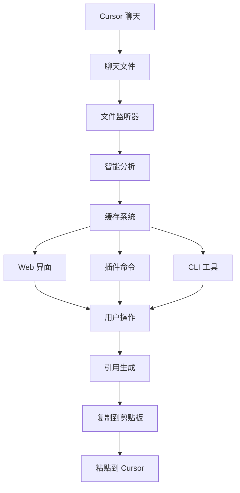

# 🧠 Cursor Chat Memory 集成指南

## 📋 系统架构

Cursor Chat Memory 是一个智能聊天记忆管理系统，包含三个主要组件：

1. **VSCode/Cursor 插件** - 提供编辑器内的命令和功能
2. **Web 管理界面** - 提供完整的图形化管理功能  
3. **CLI 工具** - 提供命令行操作和自动化支持

## 🚀 快速开始

### 1. 启动 Web 服务器

```bash
# 编译 TypeScript 并启动 Web 服务器
npm start

# 或者单独启动（需要先编译）
npm run compile
npm run web

# 开发模式启动
npm run dev

# 自定义端口启动（如端口冲突）
PORT=3001 npm start
```

Web 服务器将在 `http://localhost:3000` 启动（或指定端口）。

### 🎯 新功能: 精确来源标识

✨ **重大升级**: 现在所有引用都包含完整的来源追踪信息！

- **📁 项目标识**: 清楚区分项目相关和全局知识
- **🌐 全局标识**: 标注可跨项目复用的通用经验  
- **📍 物理来源**: 显示聊天文件的实际存储位置
- **🆔 会话ID**: 提供唯一标识符便于精确引用
- **⭐ 重要性**: 0-100% 的智能重要性评分

### 2. 安装 VSCode/Cursor 插件

```bash
# 编译插件
npm run compile

# 在 VSCode/Cursor 中按 F5 启动调试版本
# 或者打包安装到实际环境
```

### 3. 使用 CLI 工具

```bash
# 全局安装
npm install -g .

# 或者直接使用
npx cursor-memory status
```

## 🔧 Web 界面集成

### 功能模块

#### 1. 📋 历史会话管理
- **功能**: 查看、搜索、分类管理所有聊天会话  
- **API**: `/api/sessions`
- **特点**: 
  - 按重要性和时间排序
  - 智能分类和标签系统
  - 全文搜索功能
  - 批量操作支持

#### 2. 🧠 提示词中心
- **功能**: 管理全局知识库和项目经验
- **API**: `/api/prompts`
- **特点**:
  - 全局知识模板
  - 项目特定经验
  - 迭代记录追踪
  - 智能推荐系统

#### 3. ⚡ 智能引用生成
- **功能**: 根据上下文生成智能引用
- **API**: `/api/sessions/reference`
- **特点**:
  - 多种引用模板
  - 上下文感知推荐
  - 一键复制到剪贴板
  - 与插件无缝集成

#### 4. 📊 统计分析
- **功能**: 提供使用统计和趋势分析
- **特点**:
  - 会话统计
  - 分类分布
  - 使用趋势
  - 效率分析

### API 接口

#### 会话管理 API
```javascript
// 获取所有会话
GET /api/sessions

// 搜索会话
POST /api/sessions/search
{
  "query": "搜索关键词"
}

// 获取推荐会话
POST /api/sessions/recommendations
{
  "inputText": "用户输入",
  "maxSessions": 5
}

// 生成引用
POST /api/sessions/reference
{
  "templateId": "recent",
  "inputText": "上下文"
}

// 删除会话
DELETE /api/sessions/{id}
```

#### 提示词管理 API
```javascript
// 获取所有提示词
GET /api/prompts

// 搜索提示词
POST /api/prompts/search
{
  "query": "关键词",
  "category": "分类"
}

// 创建提示词
POST /api/prompts
{
  "title": "标题",
  "content": "内容",
  "type": "global|project|iteration"
}

// 获取推荐提示词
POST /api/prompts/recommendations
{
  "context": "上下文",
  "maxPrompts": 3
}
```

## 🔌 插件集成

### 主要命令

#### 1. 智能引用 (`Ctrl+Alt+M` / `Cmd+Alt+M`)
- **命令**: `cursorChatMemory.enhanceInput`
- **功能**: 打开智能选择界面，选择相关会话进行引用
- **使用场景**: 需要引用特定历史对话时

#### 2. 快速引用 (`Ctrl+Shift+M` / `Cmd+Shift+M`)  
- **命令**: `cursorChatMemory.quickReference`
- **功能**: 快速生成最近重要会话的引用
- **使用场景**: 快速获取最近的上下文信息

#### 3. 解决方案引用 (`Ctrl+Shift+S` / `Cmd+Shift+S`)
- **命令**: `cursorChatMemory.solutionReference`
- **功能**: 搜索并引用包含解决方案的历史会话
- **使用场景**: 遇到类似问题时，查找历史解决方案

#### 4. 显示状态面板
- **命令**: `cursorChatMemory.showStatus`
- **功能**: 显示系统状态和统计信息
- **使用场景**: 查看系统运行状态和会话统计

### 工作流程

1. **自动监听**: 插件自动监听 `~/.cursor/chat` 目录的变化
2. **智能分析**: 对新的聊天文件进行分析和分类
3. **缓存管理**: 维护高效的内存和磁盘缓存
4. **实时更新**: 通过事件系统实时更新界面和状态

## 🔄 数据流程



## 💡 最佳实践

### 1. Web 界面使用
- **常驻运行**: 建议将 Web 服务器作为后台服务常驻运行
- **书签收藏**: 将 `http://localhost:3000` 添加到浏览器书签
- **多标签页**: 可以同时打开多个功能标签页进行操作

### 2. 插件集成
- **快捷键使用**: 熟练使用快捷键提高效率
- **状态监控**: 定期查看状态栏的记忆服务状态
- **智能引用**: 在提问前先使用智能引用获取相关上下文

### 3. 工作流程建议
1. **开发前**: 使用智能引用查看相关历史经验
2. **遇到问题**: 使用解决方案引用查找类似问题的解决方案
3. **定期整理**: 通过 Web 界面管理和整理会话分类
4. **知识积累**: 将重要的解决方案添加到提示词中心

## 🛠️ 高级配置

### 环境变量
```bash
# Web 服务器端口
export PORT=3000

# 开发模式
export NODE_ENV=development

# 项目路径（可选）
export PROJECT_PATH=/path/to/your/project
```

### 配置文件
在项目根目录创建 `cursor-memory.config.json`:
```json
{
  "webPort": 3000,
  "maxSessions": 100,
  "compressionThreshold": 8000,
  "enableRawBackup": true,
  "categories": {
    "custom": ["自定义分类1", "自定义分类2"]
  }
}
```

## 🚀 部署和扩展

### 本地部署
- Web 服务器可以独立运行，不依赖 VSCode/Cursor
- 支持多项目切换和管理
- 可以通过 nginx 或其他代理服务器部署

### 团队协作
- 提示词中心支持导出和导入
- 会话数据可以跨设备同步
- 支持团队知识库的构建和分享

## 📞 支持和帮助

- **Web 界面**: 访问 `http://localhost:3000` 使用完整功能
- **插件命令**: 在 VSCode/Cursor 中使用 `Ctrl+Shift+P` 搜索 "Cursor Memory"
- **CLI 帮助**: 运行 `cursor-memory --help` 查看所有命令
- **日志查看**: 检查控制台输出和 `~/.cursor-memory/logs` 目录

---

🎉 **恭喜！** 您现在可以充分利用 Cursor Chat Memory 的强大功能来提升您的编程效率！ 